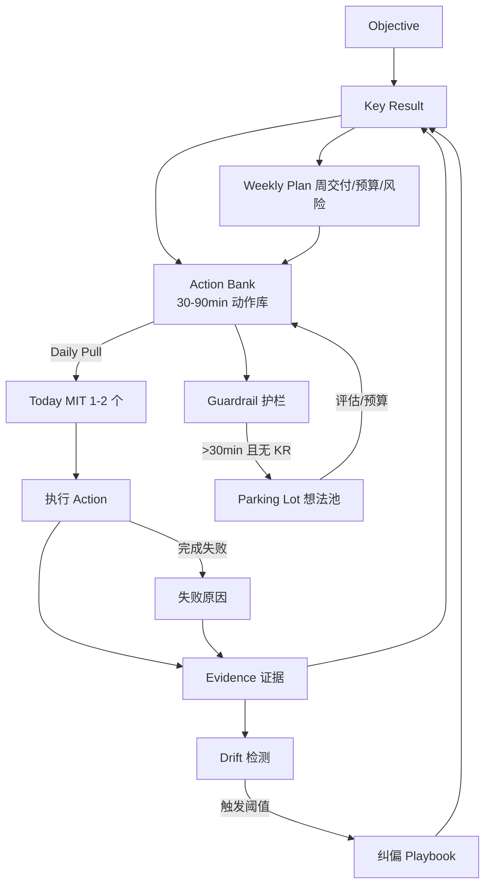

# PRD — OKR Execution OS (Bitable)

## 背景与问题
现状：OKR 文档写得清楚（O/KR/Owner/Timeline），但执行中容易偏航：
- 临时事项/兴趣发散吞噬主线
- 计划无法细到每天每小时，导致“执行层断链”
- 周更/复盘弱，证据与进展脱节

核心矛盾：不是缺规划工具，而是缺执行-反馈-纠偏闭环（Control Loop）。

## 产品目标（Outcome）
- 在不需要计划到小时的情况下，每天能拉到正确的下一步动作，并且偏航能被及时发现并纠偏。
- 把 OKR 从“文档系统”升级成“执行操作系统”。

## 目标用户
- 高频协作、项目并行的知识工作者/研发/数据/产品
- 典型场景：季度 OKR + 多项目推进 + 大量临时沟通打断

## 设计原则（产品约束）
1. Pull over Push：每天从 KR 的 Action Bank 拉任务，而不是靠日程把你推着走
2. Evidence first：进展必须绑定“可展示证据”
3. Drift detection：偏航要可度量、可报警、可一键纠偏
4. Exploration with budget：探索可被允许，但要有预算与回收产物

---

## 产品逻辑图（执行闭环）

说明：
- 主闭环：KR -> Action Bank -> Today -> Evidence -> Drift -> Playbook -> KR。
- 护栏与探索：新任务未关联 KR 且耗时高，自动进入 Parking Lot，再由预算与评估回流 Action Bank。
- 周运营：Weekly Plan 给 KR 定周交付与时间预算，反向约束 Action Bank 的供给与优先级。

---

## Big Features（大功能模块）与子能力

### A. OKR 建模与对齐（Goal System）
目的：让 O/KR 可追踪、可度量、可下钻。
- A1. O/KR 结构化创建（O、KR、Owner、周期、置信度、权重可选）
- A2. KR 类型：数值型 / 里程碑型 / 交付物型
- A3. 对齐关系：上级/下级 1 层（默认不做复杂树）
- A4. KR 口径卡：指标定义、数据源/链接、口径说明、风险假设

备注：复杂组织树、战略地图先不做，避免“拉丝纹理”。

### B. Evidence（证据系统）
目的：把“我真的推进了”具体化，避免只报状态。
- B1. 每个 KR 的 Evidence 清单模板（可配置证据类型：文档/PR/SQL/仪表盘/实验报告/会议纪要）
- B2. 证据与时间轴自动归档（按周聚合）
- B3. 证据 -> 进度更新：手动关联（MVP），后续可做半自动（从 PR/文档变更推断）

### C. Action Bank（动作库）与 Daily Pull（每日拉取）
目的：解决“规划做不到每天每小时”的断链。
- C1. 每个 KR 必须维护 Action Bank（30–90min 粒度）
- C2. 每日拉取（Today）：用户从 Action Bank 选 1–2 个 MIT（最重要任务）
- C3. 战斗时间块（Focus Block）记录：只记录“开始/结束/产出证据”，不要求精细排程
- C4. Action 完成后强制绑定：产出证据 or 失败原因（可选）

### D. Drift Detection（偏航检测）与 Guardrails（护栏纠偏）
目的：没有报警与纠偏是“跟丢”的核心原因。
- D1. 偏航指标面板（按周滚动）
  - OKR 对齐时间占比（手动或轻量记录）
  - 连续 N 天无 Evidence
  - KR 投入/进展比异常（主观进展 + 时间投入）
- D2. 偏航阈值规则（可配置默认值）
  - 非 OKR > 20% / 连续 2 天无证据 / 置信度红灯
- D3. 一键纠偏 Playbook（触发后只给 3 步）
  1) 选一个 KR 的本周交付
  2) 拉取一个最小动作（30min）
  3) 产出一个证据（哪怕是 1 页 memo）

### E. Parking Lot（想法停车场）与 Exploration Budget（探索预算）
目的：允许发散，但不让发散吞主线。
- E1. 快速收集（1 句话 + 标签 + 预计耗时）
- E2. 门禁：>30min 的新任务必须选择
  - 关联 KR + 本周证据；否则只能进入 Parking Lot
- E3. 探索预算（每周 X 小时/次数）：在预算内才可“转正”为 Initiative

### F. Weekly Ops（周运营）与 Review（复盘沉淀）
目的：把 OKR 从季末打分变成周周可控。
- F1. 周一战役计划页：每个 KR 只填 3 个字段
  - 本周交付（可展示）/ 时间预算 / 最大风险
- F2. 周五复盘页：每个 KR 3 行沉淀
  - 证据链接 / 学到什么 / 下周改动
- F3. 季度 Review：评分（0–1）+ 资产沉淀（模板/代码/决策）

### G. 协作与可视化（可选，非 MVP）
- G1. 1:1 模板（围绕 KR：进展/阻塞/资源/取舍）
- G2. 团队看板（谁在卡、谁偏航、哪个 KR 风险高）
- G3. 评论/@/认可（CFR）

---

## MVP 定义（建议切得很硬）
MVP 目标：一个人/小团队用它，能显著减少“发散一周后发现不作用于 OKR”的情况。

MVP 必须包含（最小闭环）：
1) OKR（O/KR/Owner/周期/口径链接）
2) Evidence（证据条目 + 关联 KR）
3) Action Bank（每个 KR 的动作库）
4) Today 拉取（1–2 个 MIT）
5) Parking Lot + 门禁（>30min 必须关联 KR 或入库）
6) 偏航面板（至少 2 个指标：连续无证据天数、非 OKR 占比或未关联任务数）
7) 每周战役页（本周交付/预算/风险）

MVP 明确不做（防止过度打磨）：
- 自动从各种系统抓取进度（先手动链接）
- 复杂组织对齐树、OKR 级联计算
- 花哨的日历排程到小时
- 高级报表（先把闭环跑通）

---

## 信息架构（核心页面）
1) Home：本周 Top KR 风险 + 今日 MIT
2) OKR：O 列表 -> KR 卡片（口径/Evidence/Action Bank）
3) Today：MIT + Focus Block + 产出证据入口
4) Weekly：周一计划 / 周五复盘
5) Drift：偏航指标 + 一键纠偏
6) Parking Lot：想法收集 + 探索预算

---

## 数据模型（简化版）
- Objective(id, title, owner, cycle, description)
- KeyResult(id, objective_id, title, type, metric_def, owner, confidence, target, progress)
- Evidence(id, kr_id, type, link, summary, date)
- Action(id, kr_id, title, est_minutes, status, created_at, done_at, evidence_id?)
- FocusBlock(id, action_id, start, end, note)
- Idea(id, title, note, est_minutes, linked_kr_id?, status)
- Rule(id, type, threshold, enabled)

---

## 成功指标（MVP 评价）
- 用户层：
  - 每周至少 N 条 Evidence（可配置）
  - 连续无证据天数下降
  - 未关联任务时长/次数下降
- 结果层：
  - KR 进展的稳定性提升（置信度红灯减少）
  - 季末“计划完成度”与“过程可控度”的主观评分提升

---

## 版本路线图（建议）
- V0（MVP）：闭环跑通（OKR -> Action -> Evidence -> Drift -> 纠偏）
- V1：轻协作（共享 KR、周会模板、评论）
- V2：半自动化（从 Git/Doc/BI 拉证据、进度建议）
- V3：智能教练（识别“拉丝纹理”/发散模式，主动给纠偏动作）

---

## 关键待定决策
1) MVP 偏航指标：优先选 2–3 个最有效（需结合工作形态）
2) Action Bank 模板：如何写才不会变成空话
