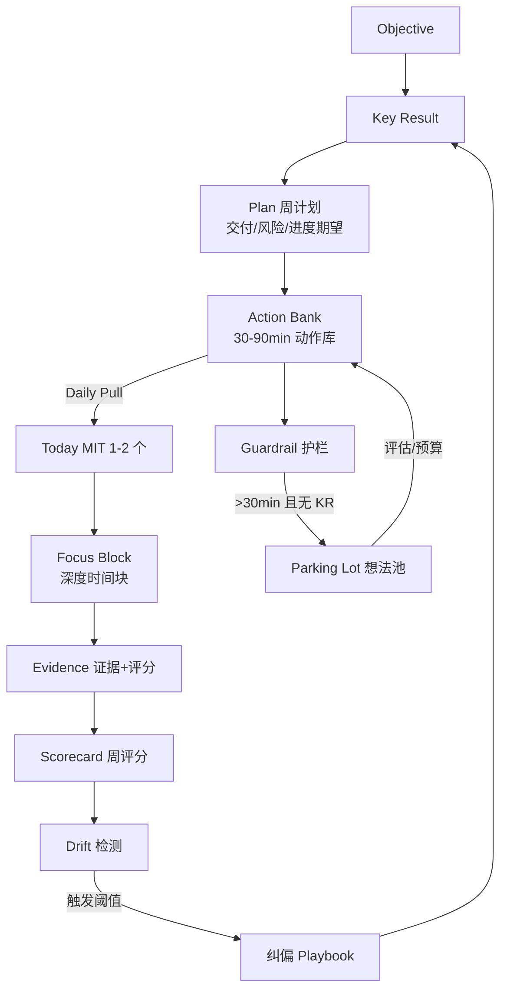

# PRD — OKR Execution OS (Bitable)

## 背景与问题
现状：OKR 文档写得清楚（O/KR/Owner/Timeline），但执行中容易偏航：
- 临时事项/兴趣发散吞噬主线
- 缺少“周粒度计划层”，导致 Daily Pull 没有时间牵引
- 证据与进展脱节，无法形成可解释评分

核心矛盾：不是缺规划工具，而是缺“计划-执行-证据-评分-纠偏”的闭环控制系统。

## 产品目标（Outcome）
- 在不需要计划到小时的情况下，每周有清晰交付目标，每天能拉到正确的下一步动作。
- 证据可评分、评分可解释、偏航可触发纠偏。
- 把 OKR 从“文档系统”升级成“执行操作系统”。

## 目标用户
- 高频协作、项目并行的知识工作者/研发/数据/产品
- 典型场景：季度 OKR + 多项目推进 + 大量临时沟通打断

## 设计原则（产品约束）
1. Plan first：周计划是 Daily Pull 的唯一牵引
2. Pull over Push：每天从 KR 的 Action Bank 拉任务，而不是靠日程把你推着走
3. Evidence first：进展必须绑定“可展示证据”
4. Scoring with reasons：评分必须可解释，并能反向牵引动作
5. Drift detection：偏航要可度量、可报警、可一键纠偏

---

## 产品逻辑图（执行闭环）

说明：
- 主闭环：KR -> Plan -> Action Bank -> Today -> Focus Block -> Evidence -> Scorecard -> Drift -> Playbook -> KR。
- 护栏与探索：新任务未关联 KR 且耗时高，自动进入 Parking Lot，再由预算与评估回流 Action Bank。
- 周计划是唯一牵引：Plan 约束 Daily Pull，Scorecard 用证据评分反向修正 Plan。

---

## Big Features（大功能模块）与子能力

### A. OKR 建模与对齐（Goal System）
目的：让 O/KR 可追踪、可度量、可下钻。
- A1. O/KR 结构化创建（O、KR、Owner、周期、置信度、权重可选）
- A2. KR 类型：数值型 / 里程碑型 / 交付物型
- A3. 对齐关系：上级/下级 1 层（默认不做复杂树）
- A4. KR 口径卡：指标定义、数据源/链接、口径说明、风险假设

备注：复杂组织树、战略地图先不做，避免“拉丝纹理”。

### B. Evidence（证据系统）
目的：把“我真的推进了”具体化，避免只报状态。
- B1. 每个 KR 的 Evidence 清单模板（可配置证据类型：文档/PR/SQL/仪表盘/实验报告/会议纪要）
- B2. 证据与时间轴自动归档（按周聚合）
- B3. 证据 -> 进度更新：手动关联（MVP），后续可做半自动（从 PR/文档变更推断）

### C. Action Bank（动作库）与 Daily Pull（每日拉取）
目的：解决“规划做不到每天每小时”的断链。
- C1. 每个 KR 必须维护 Action Bank（30–90min 粒度）
- C2. 每日拉取（Today）：用户从 Action Bank 选 1–2 个 MIT（最重要任务）
- C3. 战斗时间块（Focus Block）记录：只记录“时间块 + 产出证据”，不要求精细排程
- C4. Action 完成后强制绑定：产出证据 or 失败原因（可选）

### D. Plan（周计划牵引）
目的：把季度 OKR 落到周粒度，并成为 Daily Pull 的牵引力。
- D1. 每个 KR 每周有交付/风险/期望进度
- D2. Action 必须归属 Plan
- D3. Plan 与 Scorecard 打通，形成闭环修正

### E. Scorecard（评分驾驶舱）
目的：让执行状态可解释、可追踪、可纠偏。
- E1. 周评分拆分：结果/过程/证据/偏航扣分
- E2. 每次评分必须写“扣分原因 + 纠偏动作”
- E3. 评分驱动 Drift 与纠偏 Playbook

### F. Drift Detection（偏航检测）与 Guardrails（护栏纠偏）
目的：没有报警与纠偏是“跟丢”的核心原因。
- F1. 偏航指标面板（按周滚动）
  - OKR 对齐时间占比（手动或轻量记录）
  - 连续 N 天无 Evidence
  - KR 投入/进展比异常（主观进展 + 时间投入）
- F2. 偏航阈值规则（可配置默认值）
  - 非 OKR > 20% / 连续 2 天无证据 / 置信度红灯
- F3. 一键纠偏 Playbook（触发后只给 3 步）
  1) 选一个 KR 的本周交付
  2) 拉取一个最小动作（30min）
  3) 产出一个证据（哪怕是 1 页 memo）

### G. Parking Lot（想法停车场）与 Exploration Budget（探索预算）
目的：允许发散，但不让发散吞主线。
- E1. 快速收集（1 句话 + 标签 + 预计耗时）
- E2. 门禁：>30min 的新任务必须选择
  - 关联 KR + 本周证据；否则只能进入 Parking Lot
- E3. 探索预算（每周 X 小时/次数）：在预算内才可“转正”为 Initiative

### H. Weekly Ops（周运营）与 Review（复盘沉淀）
目的：把 OKR 从季末打分变成周周可控。
- F1. 周一战役计划页：每个 KR 只填 3 个字段
  - 本周交付（可展示）/ 时间预算 / 最大风险
- F2. 周五复盘页：每个 KR 3 行沉淀
  - 证据链接 / 学到什么 / 下周改动
- F3. 季度 Review：评分（0–1）+ 资产沉淀（模板/代码/决策）

### I. 协作与可视化（可选，非 MVP）
- G1. 1:1 模板（围绕 KR：进展/阻塞/资源/取舍）
- G2. 团队看板（谁在卡、谁偏航、哪个 KR 风险高）
- G3. 评论/@/认可（CFR）

---

## MVP 定义（建议切得很硬）
MVP 目标：一个人/小团队用它，能显著减少“发散一周后发现不作用于 OKR”的情况。

MVP 必须包含（最小闭环）：
1) OKR（O/KR/Owner/周期/口径链接）
2) Plan（周计划：交付/风险/期望进度）
3) Action Bank（每个 KR 的动作库）
4) Today 拉取（1–2 个 MIT，必须绑定 Plan）
5) Focus Block（深度时间块 + 产出证据）
6) Evidence（证据条目 + 关联 KR / Focus Block + 5 档评分）
7) Scorecard（周评分 + 扣分原因 + 纠偏动作）
8) Drift 面板（连续无证据 / 未关联 Action / 评分偏低）
9) Parking Lot + 门禁（>30min 必须关联 KR 或入库）

MVP 明确不做（防止过度打磨）：
- 自动从各种系统抓取进度（先手动链接）
- 复杂组织对齐树、OKR 级联计算
- 花哨的日历排程到小时
- 高级报表（先把闭环跑通）

---

## 信息架构（核心页面）
1) Today：Plan 选择 + MIT + Focus Block + Evidence + Drift 提醒
2) Plan：周计划列表（交付/风险/期望进度）
3) Action Bank：动作库 + 计划归属
4) Scorecard：周评分 + 扣分原因 + 纠偏动作
5) Parking Lot：想法收集 + 探索预算

---

## 数据模型（简化版）
- Objective(id, title, owner, cycle, description)
- KeyResult(id, objective_id, title, type, owner, confidence, target, progress, current_risk)
- Plan(id, kr_id, week_start, week_end, deliverable, expected_progress_delta, risk_level, status)
- Action(id, kr_id, plan_id, title, est_minutes, status)
- FocusBlock(id, action_id, plan_id, start, end, minutes, goal, evidence_id?)
- Evidence(id, kr_id, action_id, focus_block_id, type, link, date, quality, impact_hint)
- Scorecard(id, week_start, week_end, total, result, process, evidence, drift_penalty, deductions, actions)
- Idea(id, title, note, est_minutes, linked_kr_id?, status)

---

## 成功指标（MVP 评价）
- 用户层：
  - 每周至少 N 条 Evidence（可配置）
  - 证据评分稳定提升
  - 连续无证据天数下降
  - 未关联任务时长/次数下降
- 结果层：
  - KR 进展的稳定性提升（置信度红灯减少）
  - 季末“计划完成度”与“过程可控度”的主观评分提升

---

## 版本路线图（建议）
- V0（MVP）：闭环跑通（OKR -> Action -> Evidence -> Drift -> 纠偏）
- V1：轻协作（共享 KR、周会模板、评论）
- V2：半自动化（从 Git/Doc/BI 拉证据、进度建议）
- V3：智能教练（识别“拉丝纹理”/发散模式，主动给纠偏动作）

---

## 关键待定决策
1) MVP 偏航指标：优先选 2–3 个最有效（需结合工作形态）
2) Evidence 评分口径：如何避免“拉丝纹理”
3) Action Bank 模板：如何写才不会变成空话
